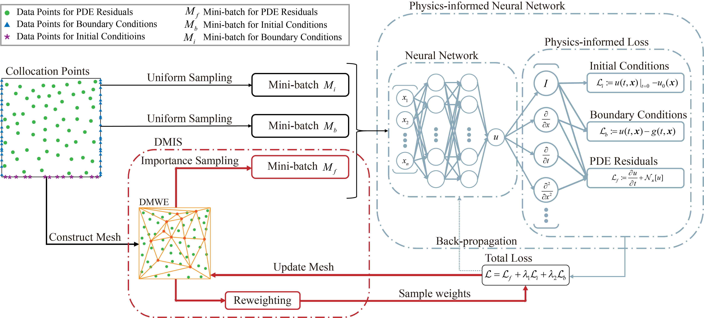

#  DMIS (AAAI2023)
Official code for "[DMIS: Dynamic Mesh-based Importance Sampling for Training Physics-Informed Neural Networks](https://ojs.aaai.org/index.php/AAAI/article/view/25669)" (AAAI 2023)



Modeling dynamics in the form of partial differential equations (PDEs) is an effectual way to understand real-world physics processes. For complex physics systems, analytical solutions are not available and numerical solutions are widely-used. However, traditional numerical algorithms are computationally expensive and challenging in handling multiphysics systems. Recently, using neural networks to solve PDEs has made significant progress, called physics-informed neural networks (PINNs). PINNs encode physical laws into neural networks and learn the continuous solutions of PDEs. For the training of PINNs, existing methods suffer from the problems of inefficiency and unstable convergence, since the PDE residuals require calculating automatic differentiation. In this paper, we propose **D**ynamic **M**esh-based **I**mportance **S**ampling (DMIS) to tackle these problems. DMIS is a novel sampling scheme based on importance sampling, which constructs a dynamic triangular mesh to estimate sample weights efficiently. DMIS has broad applicability and can be easily integrated into existing methods. The evaluation of DMIS on three widely-used benchmarks shows that DMIS improves the convergence speed and accuracy in the meantime. Especially in solving the highly nonlinear Schrödinger Equation, compared with state-of-the-art methods, DMIS shows up to 46\% smaller root mean square error and five times faster convergence speed.

## Quick Start

### Installation

#### Setup environment

Dependencies:

* PyTorch == 1.11.0
* hydra == 1.2.0
* tensorboard == 2.9.0
* sympy == 1.10.1
* scipy == 1.8.1
* pandas == 1.4.3
* numpy == 1.22.4
* matplotlib == 3.5.2

```bash
conda create --name DMIS python=3.7
conda activate DMIS
conda install --file requirements.txt
```

All the code has been tested on Ubuntu 16.04, Python 3.7.12, PyTorch 1.11.0, and CUDA 11.3

#### Clone this repository

```bash
git clone git@github.com:MatrixBrain/DMIS.git
cd DMIS
```

### Training

To train PINNs with DMIS for solving Schrödinger Equation:

```bash
python train.py --config-name=Schrodinger train_conf.pde_sampler=SamplerWithDMIS train_conf.pde_reweighting=BiasedReWeighting hydra.job.chdir=True
```

To train PINNs with uniform sampling for solving Schrödinger Equation:

```bash
python train.py --config-name=Schrodinger train_conf.pde_sampler=UniformSampler train_conf.pde_reweighting=NoReWeighting hydra.job.chdir=True
```

For other equations, you can replace ```Schrodinger``` with ```KDV```(KdV Equation), ```Burgers```(Burgers' Equation), ```Diffusion```(Diffusion Equation) and ```ACEquation ```(Allen-Cahn Equation)

### Evaluation

To evaluate PINN-O, PINN-N, DMIS used in our paper, please run:

```bash
python evaluate.py hydra.job.chdir=True
```

## Results

* Schrödinger Equation

|Method|ME|MAE|RMSE|
|:-:|:-:|:-:|:-:|
|PINN-O|1.360|0.186|0.4092|
|PINN-N|0.948|0.149|0.2906|
|xPINN|0.546|0.045|0.0089|
|cPINN|0.591|0.069|0.0169|
|**PINN-DMIS(ours)**|0.647|0.127|0.2196|
|**xPINN-DMIS(ours)**|0.867|0.036|0.0129|
|**cPINN-DMIS(ours)**|**0.358**|**0.025**|**0.0033**|

* Burgers' Equation

|Method|ME|MAE|RMSE|
|:-:|:-:|:-:|:-:|
|PINN-O|0.451|0.0738|0.1100|
|PINN-N|0.358|0.0579|0.0859|
|xPINN|0.261|0.0099|0.0010|
|cPINN|0.324|**0.0084**|**0.0007**|
|**PINN-DMIS(ours)**|**0.225**|0.0294|0.0495|
|**xPINN-DMIS(ours)**|0.420|0.0115|0.0017|
|**cPINN-DMIS(ours)**|0.397|0.0111|0.0016|

* KdV Equation

|Method|ME|MAE|RMSE|
|:-:|:-:|:-:|:-:|
|PINN-O|2.140|0.363|0.520|
|PINN-N|1.860|0.292|0.441|
|xPINN|2.462|0.272|0.230|
|cPINN|2.925|0.258|0.248|
|**PINN-DMIS(ours)**|**1.170**|0.391|0.492|
|**xPINN-DMIS(ours)**|2.380|0.233|**0.196**|
|**cPINN-DMIS(ours)**|2.680|**0.230**|0.200|

Note: The results of PINN-O are different from the provided results in the original PINN paper because we use **extrapolation precision** and the original PINN paper uses **interpolation precision**.

## Citation
If you find the code and pre-trained models useful for your research, please consider citing our paper. :blush:
```
@InProceedings{yang2022dmis,
author = {Yang, Zijiang and Qiu, Zhongwei and Fu, Dongmei},
title = {DMIS: Dynamic Mesh-based Importance Sampling for Training Physics-Informed Neural Networks},
booktitle = {AAAI},
year = {2023},
}
```
